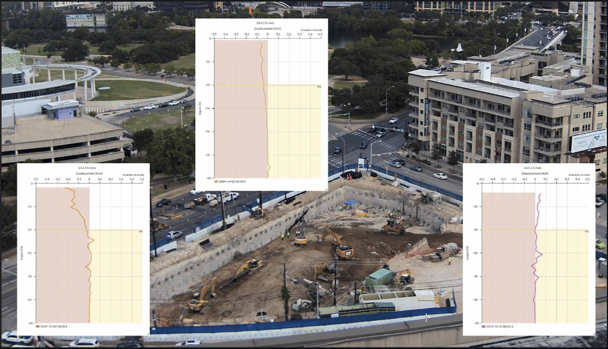
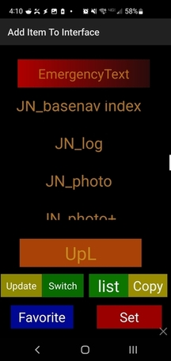
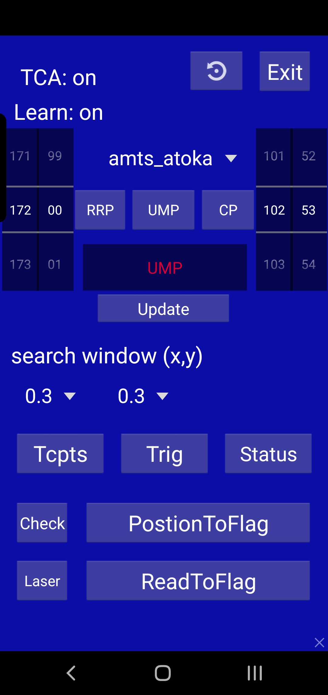
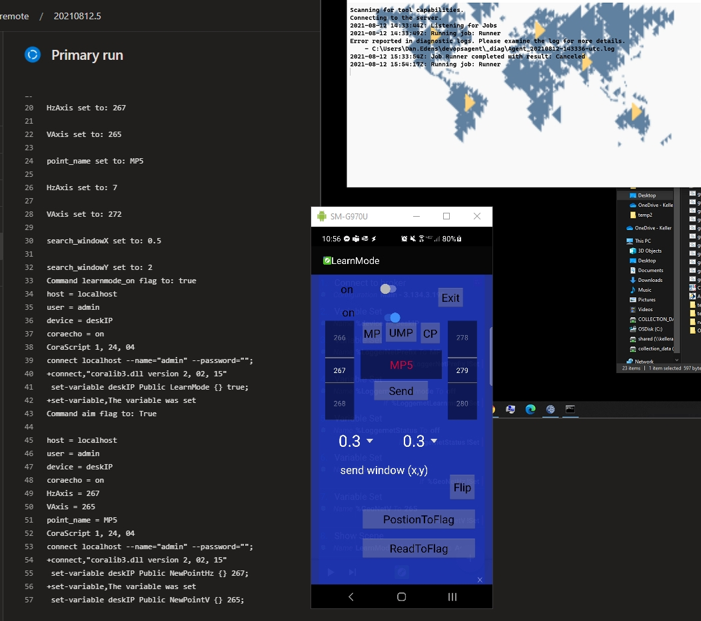
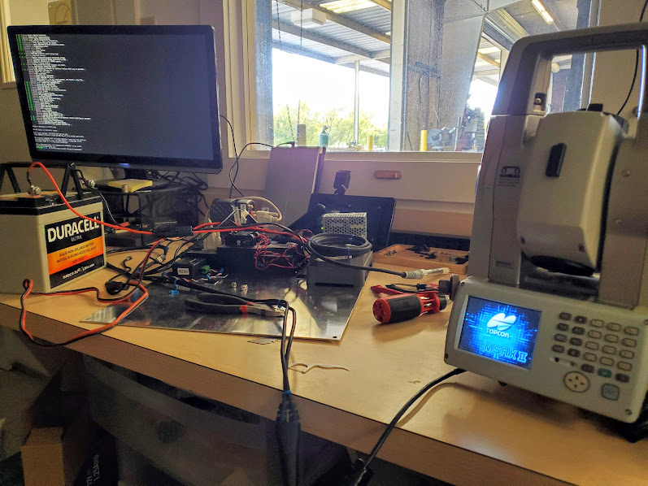
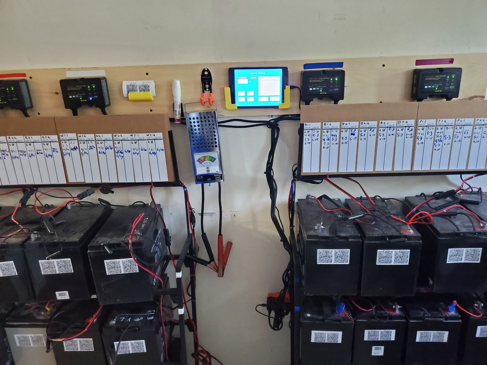
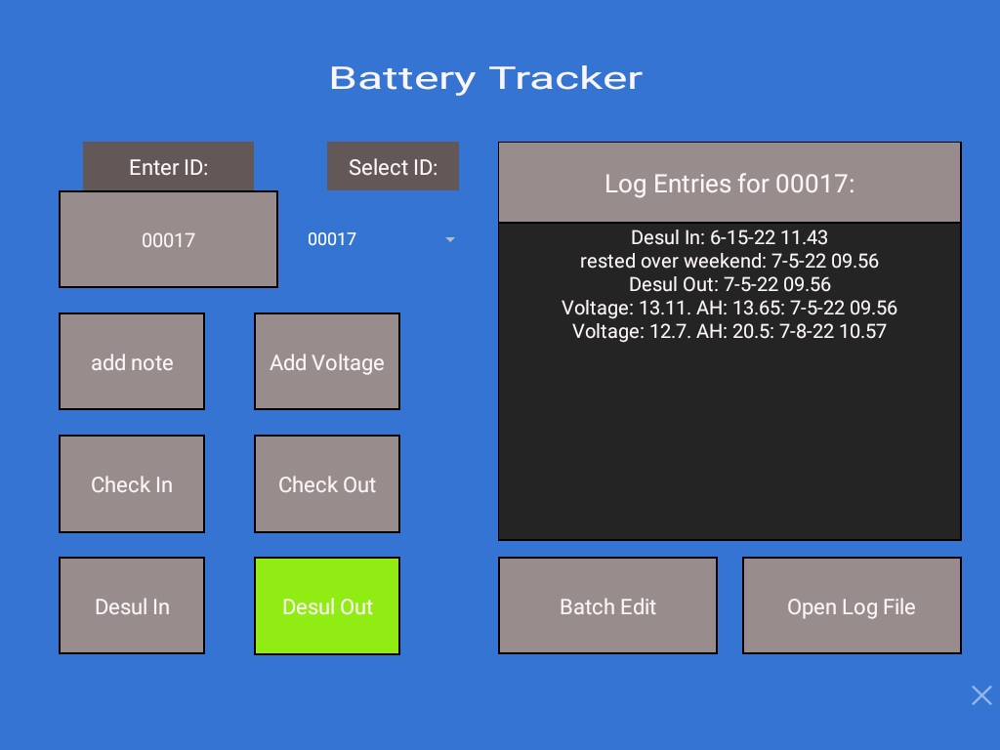

### As of 9/14 This is WIP, You are Welcome to still take a look, but Please excuse the construction :)

# QA Testkits

## DVTTestKit (Documentation and Test Case Repos)

### CDRTestkit (CDRouter Testing)
 
### AppTestKit (Motosync Mobile App Testing)

https://youtu.be/YZcmfUUZgKw

### GUITestKit (Web Browser Testing)

### AutoDocsisTestKit (Dcosis Testing)

### OnboardingTestKit (API Testing)


# Desktop Applications: 

# Project 1. Sitecheck Scanner: FrontEnd Monitoring Tool 

Sitecheck Scanner started a personal convenience project that evolved into a tool to empower Geo-Instrument's field technicians.  
We faced many challenges working in remote locations, and this caused delays in Client communication. I created Sitecheck Scanner to help field technicians stay updated with their current status, and facilitate teamwork. 


    This was my answer to the question: "How can I improve Incident response?"


### What Sitecheck Scanner Offers:

1. **Visual Tour Creation**: Sitecheck Scanner creates engaging visual tours for different Geotechnical monitoring platforms, simplifying site assessments.

1. **Field Technician's Best Friend**: Sitecheck Scanner offers real-time alerts for sensor status changes, missed readings, and setup errors while navigating plan views, streamlining your tasks.

1. **Microsoft Teams Integration**:  I've integrated Microsoft Teams with Adaptive Cards, enabling seamless issue tracking and resolution in the field without disrupting customer interactions.

1. **SQL Database Watchdog**: Sitecheck Scanner ensures data integrity by monitoring both front-end and SQL databases, providing alerts for missing sensors.

1. **Reducing Human Error**:  I've introduced decentralized database access to minimize human errors when accessing backend servers, ensuring the utmost data accuracy.


## Here's a peek at what Sitecheck Scanner can do:  
<!--  -->


**Demo on YouTube**: [Watch it here](link_to_youtube_demo)  

**GitHub Repository**: [Explore the code](https://github.com/DanEdens/sitecheck)

Skills showcased:  
**Python || SQL || Pyppeteer || Microsoft Integrations || Sphinix documentation || Accessibility**
    
Takeaway:  
Throughout the development of Sitecheck Scanner, I gained invaluable experience in navigating a data-secure environment, fostering collaboration with a dedicated team of field technicians, and constructing a versatile tool with multi-user capabilities.
    


# Project 2. SAA Timelapse Factory

SAA Timelapse Factory is a purpose-built ETL(Extract, transform, and load) product designed to manipulate Geotechnical data plots on our Quickview platform. Its primary purpose is to gather and overlay collected plots onto job site camera footage, creating timelapse videos.

## Features:

1. **Web Scraping**: Navigate through a range of specific data points and collect renderings.

1. **Data Overlay**: With Timelapse Factory, you can effortlessly overlay data plots onto job site camera footage, providing valuable context and insights.


## Demo

[Check out a demo of Timelapse Factory in action on YouTube:](https://www.youtube.com/watch?v=cgKvyPWVw6E)

[](https://www.youtube.com/watch?v=cgKvyPWVw6E)

<!-- 
## Example Usage

Here's an example of how to use Timelapse Factory to enhance your timelapse videos:

```bash
# Replace the placeholders with actual commands or usage examples
timelapse-factory --input video.mp4 --data data.csv --output output.mp4
``` -->

---

# Mobile Apps  
1. Interface Panel -  
    [Download on Taskernet](https://taskernet.com/shares/?user=AS35m8mBhJAezDTr0Lio7dopdLiBaKgozAOxoCXM7Mh8sS5hSvSst1kEMf5%2FJeJveB%2BsvU8%3D&id=Project%3AInterface)  
    - GUI for assigning scripts to Mobile device triggers such as Shake, Hardware buttons, NFC tags, and Voice commands.  
    - Used to assist in safely operating testing equipment in Industrial environments.  
    - Able to detect current job by closest address, and uses this for sorting data.  
    - "SOS button" mode to alert On-Site Safety Manager  
       

1.  LnetFieldApp  
    Frontend:   
    - Andriod App for controling [Topcon](https://www.topconpositioning.com/total-stations/robotic-total-stations/ms-axii) total stations.  
    - Internal replacement for Campbell Scientic's [Loggerlink](https://play.google.com/store/apps/details?id=com.campbellsci.loggerlink&hl=en_US&gl=US) app.  
    - Significantly improves ability to locate survey points.  
    
  
-  
    Backend:  
     - Lightweight and scalable python script that pipes MQTT topics into [Xargs](https://www.man7.org/linux/man-pages/man1/xargs.1.html).  
     - Non-blocking control of several Units through the [Loggernet CLI, Corascript](https://www.campbellsci.com/loggernet).  
     - Server utilizes Python, Xargs, and Mosquitto.  
    
---

## Software for the Shop  
1. AMTSworkshop  
    *Began as migration of 20 years worth of Campbell Scientific Datalogger programs into Git.*  
      
    - Worked on an R&D project for a new type of Monitoring prism.  
    - Azure DevOps pipelines for testing each commit on live lab equipment  
    - Designed to handle rolling out changes slowly due to certain project specs requiring legacy versions on remote data loggers.  
    
1. Geo Battery Bot  
    [Check it out on Github](https://github.com/DanEdens/GeoBatteryBot_public)  
      
      
    Mobile app for tracking inventory of Geo-instrument's fleet of 110ah AGM batteries.  
    This is used to manage the [desulfating](https://www.upsbatterycenter.com/blog/battery-desulfation/) schedule.  
    
    - I created a QRcode generator which publishes a number and status to the (Join API)[https://joaoapps.com/join/api/].  
    - A tablet located in the Geo-Instrument's Shop acts as the server.  
    - Created an Android app as GUI and back-end to log unit events.  
    - Stickers are generated in a given range of serial numbers by the [python script: QR-generator.py](https://github.com/DanEdens/GeoBatteryBot_public/blob/master/qr-generator.py)  
---


#  Project Portfolio:

1. [MSE Wall Repair (Project Spotlight)](https://www.geo-instruments.com/mse-wall-repair/)
    - Apr 2021 - Oct 2021
    - Planned and executed a Monitoring plan for a collapsed MSE wall in Fort Worth, Tx.
    - Deployed Tiltmeters and Crack monitoring equipment to monitor for movement during wall repair.
    - Built and Maintained Client website displaying Tiltmeter and AMTS Data.

1. [Lock and Dam (Project Spotlight)](http://www.massman.net/project/columbia-lock-dam-emergency-repairs)
    - Nov 2018 - Feb 2019
    - Emergency Repair of an Army Corps of Engineers' Lock and Dam.  
    - Provided Equipment troubleshooting and Live Data monitoring for the repair team.  
    - Developed a Grout logging app for Crew working in heavy storming.  
    - Deployed Piezometers and Tiltmeters 40 feet underwater on the Dam's slab.  

1. [Capitol Complex Excavation](https://www.tfc-ccp.org/)
    - Mar 2018 - Jul 2022
    - Excavation monitoring in downtown Austin, Tx.
    - Installed AMTS systems, Tiltmeters, Automated Inclinometers, and Vibration Monitors.

1. [SH288 WSE wall failure (News Article on Emergency)](https://abc13.com/sh-288-pavement-failure-safety-purposes-structural-damage/10527940/)
    - Apr 2021 - Oct 2021
    - Provided the client with SAA and Piezometer data during operations.
    - These were used to monitor for additional settlement and the height of the water table during Emergency repairs.

1. [Fuji (Project News article)](https://www.nola.com/news/business/article_a9e05f91-a734-5bd1-8d05-587258f6a3c0.html)
    - Aug 2021 - Apr 2022
    - Tunneling Monitoring below 14 lines of Railroad.
    - Provided the client with Settlement data during Operations.

1. [Pittman Hotel (Project News article)](https://www.dmagazine.com/commercial-real-estate/2020/06/first-look-the-kimpton-pittman-hotel-in-deep-ellum/)
    - Aug 2018 - Apr 2019
    - Monitoring underpinning activities during the preservation project of The Pittman Hotel in Dallas, Tx
    - Provided the client with a website for viewing Settlement and tilt data.

1. [425 Riverside (Project News article)](https://www.realcomm.com/news/1045/1/river-south-austin-introducing-the-smart-building)
    - May 2019 - Jun 2020
    - Diaphragm wall project in Downtown Austin, TX
    - Data used to verify design loads during construction, resulting in the elimination of a row of anchors.

1. [Atoka Pipeline Repair (Project News article)](https://tunnelingonline.com/crossing-the-canadian-river/?oly_enc_id=9796A6381467B9S)
    - Jul 2019 - Jan 2022
    - Tunneling project to relocate a Water pipeline underground
    - Installed 2 AMTS systems to monitor the active water pipeline during blasting activities

1. [Government Center Parking Garage - MBTA Greenline  LT(Project News article)](https://www.wcvb.com/article/mbta-green-line-service-suspended-government-center-garage/40399135)
    - May 2022
    - Load Test performed on supports affected by the Government Center Garage collapse in Boston, MA.
    - Deployed MPBX Laser systems and String potentiometer during testing.


.. |image1| image:: assets/ExampleSitecheckScannerTeamsCardGeneration.jpg
    :width: 400
