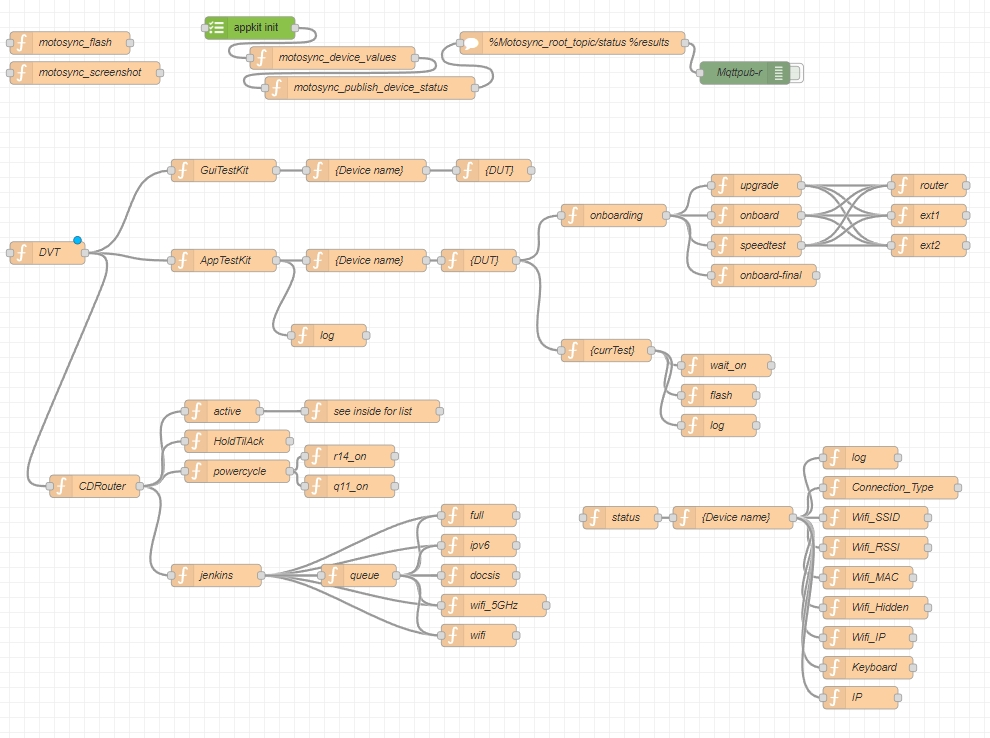

## Section Index

- [QA Testkits](#QA-Testkits)
- [Desktop Applications](#Desktop-Applications)
- [Mobile Apps](#Mobile-Apps)
- [Monitoring Portfolio](#Monitoring-Portfolio)
- [Personal Projects](#Personal-Projects)

<!-- - [Grepper Profile](https://www.grepper.com/profile/dan-edens) -->

## Portfolio Todo List

    This is a living document, and is recurrently undergoing renovations. 
    Please reach out if you would like more information.
 
<!-- 1. Finish linking Youtube Demos -->
1. Update descriptions for projects without them
1. Re-align images and make section styling consistent
1. Create a created content section for taskernet shares, grepper, gists, etc
1. Finish videos with voice over explanation

--------------
# QA Testkits   
[Back to top](#QA-Testkits)

## DVTTestKit (Documentation and Test Case Repos)
 
 Shared library that wraps tooling called by other Testkits.
 This handles interactions with third party APIs and Network configurations.
 
Features:  

1. Autodoc Sphinx-confluence builder  
1. Custom logger  
1. Jenkins api wrapper  
1. Slack api wrapper  
1. Jira api wrapper  
1. Confluence api wrapper  
1. Lab Equipment api wrapper  

    

### CDRTestkit (CDRouter Testing) 

Python Library utilizing Jenkins for managing CDRouter testing. 


Features:  

1. Slackbot reporting  
1. Aruba switch controller  
1. Smart plug Alexa integration  
1. Conducts Wifi, docsis, Ipv6, and various other Router tests  

    

### AppTestKit (Motosync Mobile App Testing)

Tasker Library triggered by Jenkins for controlling the Motosync Mobile App for testing.  

features:  
    
1. Ui tests  
1. CSE scrapping
    
**Demo on YouTube**: [Watch it here](https://youtu.be/sR9x9xHP7m4)  
    [](https://youtu.be/sR9x9xHP7m4)


<!-- ### GUITestKit (Web Browser Testing)

Python Library utilizing selenium for browser testing

features:
    GUI tests for  -->
<!-- ### AutoDocsisTestKit (Docsis Testing)

Python Library for Automating Docsis Test cases using SNMP -->

### OnboardingTestKit (API Testing)

Bash/Python Library for automating Router onboarding and API Testing  

features:  

1. Database Inventory cycler  
1. Automated firmware upgrade debugging  
1. Automated device onboarding  

    
 
    

**Demo on YouTube**: [Watch it here](https://www.youtube.com/watch?v=cgKvyPWVw6E)  
    [](https://www.youtube.com/watch?v=cgKvyPWVw6E)

--------------
# Desktop Applications:  
[Back to top](#QA-Testkits)

## Sitecheck Scanner: FrontEnd Monitoring Tool 

Sitecheck Scanner started a personal convenience project that evolved into a tool to empower Geo-Instrument's field technicians.  
We faced many challenges working in remote locations, and this caused delays in Client communication. I created Sitecheck Scanner to help field technicians stay updated with their current status, and facilitate teamwork. 


    This was my answer to the question: "How can I improve Incident response?"


### What Sitecheck Scanner Offers:

1. **Visual Tour Creation**: Sitecheck Scanner creates engaging visual tours for different Geotechnical monitoring platforms, simplifying site assessments.

1. **Field Technician's Best Friend**: Sitecheck Scanner offers real-time alerts for sensor status changes, missed readings, and setup errors while navigating plan views, streamlining your tasks.

1. **Microsoft Teams Integration**:  I've integrated Microsoft Teams with Adaptive Cards, enabling seamless issue tracking and resolution in the field without disrupting customer interactions.

1. **SQL Database Watchdog**: Sitecheck Scanner ensures data integrity by monitoring both front-end and SQL databases, providing alerts for missing sensors.

1. **Reducing Human Error**:  I've introduced decentralized database access to minimize human errors when accessing backend servers, ensuring the utmost data accuracy.

<!--  

-->

**GitHub Repository**: [Explore the code](https://github.com/DanEdens/sitecheck)  
**Demo on YouTube**: [Watch it here](https://www.youtube.com/watch?v=HExwe__eeJU)  
    [](https://www.youtube.com/watch?v=HExwe__eeJU)
  

#### Skills showcased:  
Python || SQL || Pyppeteer || Microsoft Integrations || Sphinix documentation || Accessibility
    
#### Takeaway:  

    Throughout the development of Sitecheck Scanner,   
    I gained invaluable experience in navigating a data-secure environment,  
    fostering collaboration with a dedicated team of field technicians,  
    and constructing a versatile tool with multi-user capabilities.  
    


## SAA Timelapse Factory

SAA Timelapse Factory is a purpose-built ETL(Extract, transform, and load) product designed to manipulate Geotechnical data plots on our Quickview platform. Its primary purpose is to gather and overlay collected plots onto job site camera footage, creating timelapse videos.

## Features:

1. **Web Scraping**: Navigate through a range of specific data points and collect renderings.

1. **Data Overlay**: With Timelapse Factory, you can effortlessly overlay data plots onto job site camera footage, providing valuable context and insights.


**Demo on YouTube**: [Watch it here](https://www.youtube.com/watch?v=cgKvyPWVw6E)
[](https://www.youtube.com/watch?v=cgKvyPWVw6E)

<!-- 
## Example Usage

Here's an example of how to use Timelapse Factory to enhance your timelapse videos:

```bash
# Replace the placeholders with actual commands or usage examples
timelapse-factory --input video.mp4 --data data.csv --output output.mp4
``` -->

---


## WebSiteSetup Alignment Tool - Mousegrid

Features:  

1. Manipulates mouse coordinates to help align Icons for data planview  
1. Designed as an extendable framework for fine-grain mouse control  

      
**Demo on YouTube**: [Watch it here](https://youtu.be/Z84uz_GfZas)  
    [](https://youtu.be/Z84uz_GfZas)

--------------
# Mobile Apps  
[Back to top](#QA-Testkits)

## Interface Panel - Dynamic Android Hotkeys   

[Download on Taskernet](https://taskernet.com/shares/?user=AS35m8mBhJAezDTr0Lio7dopdLiBaKgozAOxoCXM7Mh8sS5hSvSst1kEMf5%2FJeJveB%2BsvU8%3D&id=Project%3AInterface)  
- GUI for assigning scripts to Mobile device triggers such as Shake, Hardware buttons, NFC tags, and Voice commands.  
- Used to assist in safely operating testing equipment in Industrial environments.  
- Able to detect current job by closest address, and uses this for sorting data.  
- "SOS button" mode to alert On-Site Safety Manager  

    

##  LnetFieldApp  
Frontend:   
1. Andriod App for controling [Topcon](https://www.topconpositioning.com/total-stations/robotic-total-stations/ms-axii) total stations.  
1. Internal replacement for Campbell Scientic's [Loggerlink](https://play.google.com/store/apps/details?id=com.campbellsci.loggerlink&hl=en_US&gl=US) app.  
1. Significantly improves ability to locate survey points.  

    [](https://youtu.be/vzq6agjWPe0)


Backend:  
1. Lightweight and scalable python script that pipes MQTT topics into [Xargs](https://www.man7.org/linux/man-pages/man1/xargs.1.html).  
1. Non-blocking control of several Units through the [Loggernet CLI, Corascript](https://www.campbellsci.com/loggernet).  
1. Server utilizes Python, Xargs, and Mosquitto.  

**Demo on YouTube**: [Watch it here](https://youtu.be/vzq6agjWPe0)  
[](https://youtu.be/vzq6agjWPe0)

--------------
# Software for the Shop  
[Back to top](#QA-Testkits)

## AMTSworkshop  
*Began as migration of 20 years worth of Campbell Scientific Datalogger programs into Git.*  
1. Worked on an [R&D project for a new type of Monitoring prism.](https://github.com/DanEdens/Resume/blob/main/Portfolio/assets/geo/road-flush-prisms.jpg)   
1. Azure DevOps pipelines for testing each commit on live lab equipment  
1. Designed to handle rolling out changes slowly due to certain project specs requiring legacy versions on remote data loggers.  

      
    
## Geo Battery Bot  
Mobile app for tracking inventory of Geo-instrument's fleet of 110ah AGM batteries.  
This is used to manage the [desulfating](https://www.upsbatterycenter.com/blog/battery-desulfation/) schedule.  
    
1. I created a QRcode generator which publishes a number and status to the [Join API](https://joaoapps.com/join/api/).  
1. A tablet located in the Geo-Instrument's Shop acts as the server.  
1. Created an Android app as GUI and back-end to log unit events.  
1. Stickers are generated in a given range of serial numbers by the [python script: QR-generator.py](https://github.com/DanEdens/GeoBatteryBot_public/blob/master/qr-generator.py)  

    [Check it out on Github](https://github.com/DanEdens/GeoBatteryBot_public)  
      
      

--------------
# Monitoring Portfolio:   
[Back to top](#QA-Testkits)  

## [MSE Wall Repair](https://www.geo-instruments.com/mse-wall-repair/)  
[Project Spotlight](https://www.geo-instruments.com/mse-wall-repair/)  
Apr 2021 - Oct 2021  
    
1. Planned and executed a Monitoring plan for a collapsed MSE wall in Fort Worth, Tx.  
1. Deployed Tiltmeters and Crack monitoring equipment to monitor for movement during wall repair.  
1. Built and Maintained Client website displaying Tiltmeter and AMTS Data.  

## [Lock and Dam](http://www.massman.net/project/columbia-lock-dam-emergency-repairs)  
[Project Spotlight](http://www.massman.net/project/columbia-lock-dam-emergency-repairs)


Nov 2018 - Feb 2019  
1. Emergency Repair of an Army Corps of Engineers' Lock and Dam.  
1. Provided Equipment troubleshooting and Live Data monitoring for the repair team.  
1. Developed a Grout logging app for Crew working in heavy storming.  
1. Deployed Piezometers and Tiltmeters 40 feet underwater on the Dam's slab.  

    

## [Capitol Complex Excavation](https://www.tfc-ccp.org/)  
[Project Spotlight](https://www.tfc-ccp.org/)  
[Related News Article](https://austin.towers.net/downtown-austins-capitol-complex-project-finally-unveils-its-texas-mall/)  
Mar 2018 - Jul 2022  
    
1. Excavation monitoring in downtown Austin, Tx.  
1. Installed AMTS systems, Tiltmeters, Automated Inclinometers, and Vibration Monitors.  

    

## SH288 WSE wall failure 
[News Article on Emergency](https://abc13.com/sh-288-pavement-failure-safety-purposes-structural-damage/10527940/)  
Apr 2021 - Oct 2021  
1. Provided the client with SAA and Piezometer data during operations.  
1. These were used to monitor for additional settlement and the height of the water table during Emergency repairs.  

    

## [Fuji Vegetable Oil Tunneling](https://www.nola.com/news/business/article_a9e05f91-a734-5bd1-8d05-587258f6a3c0.html)  
[Project News article](https://www.nola.com/news/business/article_a9e05f91-a734-5bd1-8d05-587258f6a3c0.html)  
Aug 2021 - Apr 2022  
    
1. Tunneling Monitoring below 14 lines of Railroad.  
1. Provided the client with Settlement data during Operations.  

    

## [Pittman Hotel](https://www.dmagazine.com/commercial-real-estate/2020/06/first-look-the-kimpton-pittman-hotel-in-deep-ellum/)  
[Project News article](https://www.dmagazine.com/commercial-real-estate/2020/06/first-look-the-kimpton-pittman-hotel-in-deep-ellum/)
Aug 2018 - Apr 2019  
    
1. Monitoring underpinning activities during the preservation project of The Pittman Hotel in Dallas, Tx  
1. Provided the client with a website for viewing Settlement and tilt data.  
    
      

## [425 Riverside Excavation Monitoring](https://www.realcomm.com/news/1045/1/river-south-austin-introducing-the-smart-building)
[Project News article](https://www.realcomm.com/news/1045/1/river-south-austin-introducing-the-smart-building)
May 2019 - Jun 2020  
    
1. Diaphragm wall project in Downtown Austin, TX  
1. Data used to verify design loads during construction, resulting in the elimination of a row of anchors.  
    
    

## [Atoka Pipeline Repair](https://tunnelingonline.com/crossing-the-canadian-river/?oly_enc_id=9796A6381467B9S)  
[Project News article](https://tunnelingonline.com/crossing-the-canadian-river/?oly_enc_id=9796A6381467B9S)
Jul 2019 - Jan 2022  
    
1. Tunneling project to relocate a Water pipeline underground  
1. Installed 2 AMTS systems to monitor the active water pipeline during blasting activities  

      

## [Government Center Parking Garage - MBTA Greenline](https://www.wcvb.com/article/mbta-green-line-service-suspended-government-center-garage/40399135)  
[Project News article](https://www.wcvb.com/article/mbta-green-line-service-suspended-government-center-garage/40399135)
May 2022  
    
1. Load Test performed on supports affected by the Government Center Garage collapse in Boston, MA.  
1. Deployed MPBX Laser systems and String potentiometer during testing.  

      

--------------
# Personal Projects  
[Back to top](#QA-Testkits)  

## Raidlock  
Automation for Mobile games "Raid Shadow Legends" and "Last Shelter: Survival"  

Features:  

1. Automatically selects the best attack for each monster  
1. Preforms daily tasks automatically  
1. Reduces clicks required to play in Arena by monitoring Android logcat  
1. Alexa Intergration!  

      

<!-- .. |image1| image:: assets/ExampleSitecheckScannerTeamsCardGeneration.jpg
    :width: 400 -->

<!-- 
## Monitoring Portfolio

### Fuji Vegetable Oil Tunneling
[Project News Article](https://www.nola.com/news/business/article_a9e05f91-a734-5bd1-8d05-587258f6a3c0.html)
Aug 2021 - Apr 2022

- Tunneling Monitoring below 14 lines of Railroad.
- Provided the client with Settlement data during Operations.

### 425 Riverside Excavation Monitoring
[Related News Article](https://www.realcomm.com/news/1045/1/river-south-austin-introducing-the-smart-building)
May 2019 - Jun 2020

- Diaphragm wall project in Downtown Austin, Tx.
- Data used to verify design loads during construction, resulting in the elimination of a row of anchors.

### Atoka Pipeline Repair
[Related News Article](https://tunnelingonline.com/crossing-the-canadian-river/?oly_enc_id=9796A6381467B9S)
Jul 2019 - Jan 2022

- Tunneling project to relocate a Water pipeline underground.
- Installed 2 AMTS systems to monitor the active water pipeline during blasting activities.

### Government Center Parking Garage
[Related News Article](https://www.wcvb.com/article/mbta-green-line-service-suspended-government-center-garage/40399135)
May 2022

- Load Test performed on supports affected by the Government Center Garage collapse in Boston, MA.
- Deployed MPBX Laser systems and String potentiometer during testing.

### MSE Wall Repair
[Project Spotlight](https://www.geo-instruments.com/mse-wall-repair/)
2021

- I oversaw Settlement Monitoring during repair of a collapsed MSE wall in Fort Worth, TX.
- Settlement was monitored using Tiltmeters and Automated Total Stations during the wall's repair.

### Capitol Complex Excavation
[Project Website](https://www.tfc-ccp.org/)
[Related News Article](https://austin.towers.net/downtown-austins-capitol-complex-project-finally-unveils-its-texas-mall/)
Mar 2018 - Jul 2022

- Excavation monitoring in Downtown Austin, Tx.
- Installed AMTS systems, Tiltmeters, Automated inclinometers, and Vibration Monitors.

### SH288 MSE wall failure
[Related News Article](https://abc13.com/sh-288-pavement-failure-safety-purposes-structural-damage/10527940/)
Apr 2021 - Oct 2021

- Provided the client with SAA and Piezometer data during operations.
- These were used to monitor for additional settlement and the height of the water table during Emergency repairs.

### Columbia-Lock and Dam - Emergency repairs
[Project Spotlight](http://www.massman.net/project/columbia-lock-dam-emergency-repairs)
Nov 2018 to Feb 2019

- Emergency Repair of an Army Corps of Engineers' Lock and Dam.
- Provided Equipment troubleshooting and Live Data monitoring for the repair team.
- Developed a Grout logging app for Crew working in heavy storming.
- Deployed Piezometers and Tiltmeters 40 feet underwater on the Dam's slab. -->