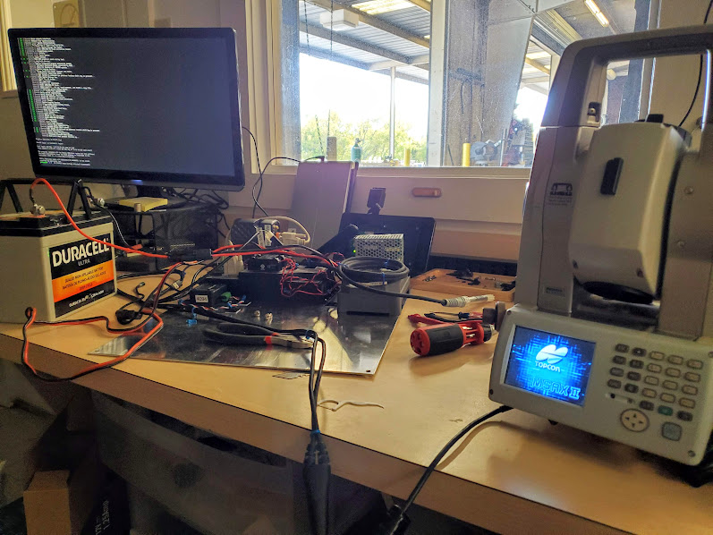

[Dan Edens](https://github.com/DanEdens)  

[(469)-636-7704](4696367704)  

[DanEdens31@gmail.com](DanEdens31@gmail.com)  

Skills Summary  
  

---
Self Sufficient and Driven Software Engineer with a focus on Process Automation and Data Collection. 
Offering a wide range of experience in Project management, Data collection, Risk mitigation, and Compliance documentation.  

Hands-on field experience spent ensuring data flow from sensors and assisting clients with data utilisation, yielded a strong practical sense for user-centred Design.  

Incomprehensive list of tools I have delivered products using:  
- Python, NodeJS, Javascript, Java, Visual Basic, HTML, REST, PHP, SQL, MQTT, and a variety of APIs  
- Cloud platforms including Azure, AWS, and self-hosted services  
- DevOps CI/CD, Containerization, and Documentation generation  

# Work History  
## Geo-Instruments  
> 06/2018 - Present (07/2022)   
  
> [VIdeo detailing what we do at Geo-instruments](https://www.geo-instruments.com/implementing-geotechnical-monitoring-programs/)  

Geotechnical Monitoring specialist responsible for managing projects including Data collection, Web development, Risk mitigation and Compliance documentation for a variety of industries.  

- Experienced Operating Independently, and worked as a stand-alone remote branch for 3.5 years.  
- Managed multiple projects with job sites across the Midwest.  
- Built backends for data collection and set up project Websites using Python, Javascript, NodeJS, MQTT, SQL, and PHP.  
- Developed tools to improve efficiency and Issue response time.  
- Experience with Data acquisition tools such as Solar controllers, Modems, Sensors, and dataloggers.  

In addition to this Project management role, I heavily engaged myself in our Apps and Software departments.  

Some of these duties include:  
1. Setting up Customer websites  
1. Automating data collection of field sensors  
1. Alert Investigation  
1. Setting up and maintaining reports to clients  

  
<!-- • Certifications: 
> Osha10, Twic, TSAprecheck, Keolis ROW, E-railSafe, BNSF contractor  -->
<!-- [E-railSafe](https://erailsafe.com/usa/), [BNSF contractor card](assets/BNSF%20Contractor%20Card.jpg)  -->

<!-- # Portfolio:   -->

---
# Tools for Project Management  
1. Sitecheck Scanner  
    - [Check it out on Github](https://github.com/DanEdens/sitecheck)  
    - [Demo On Youtube](https://www.youtube.com/watch?v=HExwe__eeJU)    
    - [pip install sitecheck](https://pypi.org/project/sitecheck/0.8.1.1/)  
          
    
    - A guided visual tour of project websites.  
    - Automated Browser used for detecting setup errors, missed readings, and anomalous data.  
    - Navigates through projects and highlights changes in sensor status.  
    - CLI for end-to-end testing project websites.  
    - Posts results to the company Team's channels.  
    <!-- - Written originally in Nodejs then migrated to python for the Apps team's benefit.   -->  
    <!-- - Geo-Instrument's Project managers and Apps team, used pull information on missing sensor data.   -->
    - Assists Geo-Instrument's field techs with keeping an eye on multiple projects while working in the field.  
    - SQL database is checked and any sensors missing longer than 22 hours are reported to an MQTT broker.  
    - Reduces load on the server for project checks, and prevents missed issues when working with sensors on very congested plan views.  
    - Results customizable for each project manager  

1. Timelapse_factory  
    - [Demo On Youtube](https://www.youtube.com/watch?v=cgKvyPWVw6E)  
 
    - NodeJS Web scrapper for pulling plots of data graphed on our Quickview platform.
     
    - Used to overlay data from sensors installed in the Diaphragm wall onto Jobsite Camera footage.  

---   
# Tools for the Field  
1. Interface Panel -  
    [Download on Taskernet](https://taskernet.com/shares/?user=AS35m8mBhJAezDTr0Lio7dopdLiBaKgozAOxoCXM7Mh8sS5hSvSst1kEMf5%2FJeJveB%2BsvU8%3D&id=Project%3AInterface)  
    - GUI for assigning scripts to Mobile device triggers such as Shake, Hardware buttons, NFC tags, and Voice commands.  
       
    - Used to assist in safely operating testing equipment in Industrial environments.  
    - Able to detect current job by closest address, and uses this for sorting data.  
    - "SOS button" mode to alert On-Site Safety Manager  

1. LnetFieldApp  
    Frontend:   
    - Andriod App for controling [Topcon](https://www.topconpositioning.com/total-stations/robotic-total-stations/ms-axii) total stations.  
    
    - Internal-use replacement for Campbell Scientic's [Loggerlink](https://play.google.com/store/apps/details?id=com.campbellsci.loggerlink&hl=en_US&gl=US) app.  
    - Significantly improved ability to zero in on survey points.  
  
-  
    Backend:  
    
     - Lightweight and scalable python script that pipes MQTT topics into [Xargs](https://www.man7.org/linux/man-pages/man1/xargs.1.html).  
     - Non-blocking control of several Units through the [Loggernet CLI, Corascript](https://www.campbellsci.com/loggernet).  
     - Server utilizes Python, Xargs, and Mosquitto.  
---

# Tools for the Shop  
1. AMTSworkshop  
    *Began as migration of 20 years worth of Campbell Scientific Datalogger programs into Git.*  
      
    - Worked on an R&D project for a new type of Monitoring prism.  
    - Azure DevOps pipelines for testing each commit on live lab equipment  
    - Designed to handle rolling out changes slowly due to certain project specs requiring legacy versions on remote data loggers.  
    
1. Geo Battery Bot  
    [Check it out on Github](https://github.com/DanEdens/GeoBatteryBot_public)  
      
      
    Mobile app for tracking inventory of Geo-instrument's fleet of 110ah AGM batteries.  
    This is used to manage the [desulfating](https://www.upsbatterycenter.com/blog/battery-desulfation/) schedule.  
    
    - I created a QRcode generator which publishes a number and status to the (Join API)[https://joaoapps.com/join/api/].  
    - A tablet located in the Geo-Instrument's Shop acts as the server.  
    - Created an Andriod app as GUI and backend to log unit events.  
    - Stickers are generated in a given range of serial numbers by the [python script: QR-generator.py](https://github.com/DanEdens/GeoBatteryBot_public/blob/master/qr-generator.py)  
---

## Chili's Grill and Bar  
> 4570 TX-121, Lewisville, TX 75056 - (214) 494-6341  
> Prep Cook: 01/2016 to 06/2018  
1. Motivated food industry worker offering over 5 years of experience.  
1. Lead Prep team, Maintained a show-ready kitchen for Chili's Test location  
1. Took part in Franchise showcases and assisted in Marketing events such as filming TV commercials.  
1. Worked closely with corporate offices to help field test timely and effective ways to improve menu recipes and standards.  
1. Created a hands-free Recipe app for the kitchen's tablet.  
1. Created Cooling log and Inventory tracking app.  
1. Collected data on the accuracy of daily On-hand food quantities for a 6-month period. This Resulted in Improved Daily prep list efficiency.  
  
---
  
## Chili's Grill and Bar  
> 190 Williamson Blvd, Ormond Beach, FL 32174 - (386) 672-7760  
> Prep Cook: 06/2014 to 09/2015  

---

## [Wood (Previously known as AMEC Earth & Environmental)](https://www.woodplc.com/) 
> 4490 Beltway Drive, Addison, TX 75001 - (469) 828-4100  
Laboratory Technician 08/2013 to 03/2014  

1. Performed laboratory testing on concrete and soil samples.  
1. Collected and maintained data reports detailing project samples.  
1. Managed test scheduling and preserving samples in limestone storage tanks  

• Certifications:  
[ACI Concrete Technicain certification](https://www.concrete.org/certification/certificationprograms.aspx?m=details&pgm=Field%20Concrete%20Testing&cert=Concrete%20Field%20Testing%20Technician%20-%20Grade%20I)  

---
# Education  
Associate of Arts: Computer Science  
North Lake College - Irving, TX: 2012-2014  
 - Focused on coursework in Mathematics and Intro to C++  

---
#  Project Portfolio:  

1. [MSE Wall Repair (Project Spotlight)](https://www.geo-instruments.com/mse-wall-repair/)  
    - Planned and executed a Monitoring plan for a collapsed MSE wall in Fort Worth, Tx.  
    - Deployed Tiltmeters and Crack monitoring equipment to monitor for movement during wall repair.  
    - Built and Maintained Client website displaying Tiltmeter and AMTS Data.  
     
1. [Lock and Dam (Project Spotlight)](http://www.massman.net/project/columbia-lock-dam-emergency-repairs)  
    - Emergency Repair of an Army Core of Engineer's Lock and Dam that required being on-site nearly around the clock for a period of 3 months.  
    - I provided Equipment troubleshooting and Live Data monitoring for the repair team.  
    - Developed a Grout logging app for Crew working in heavy storming.  
    - Deployed 12 Tiltmeters 40 feet underwater on the Dam's slab.  
    - Deployed 12 Vibrating Wire Piezometers in packers installed into the slab by a team of Divers  
    
1. [Capitol Complex Excavation](https://www.tfc-ccp.org/)  
    - Excavation monitoring in downtown Austin, Tx.  
    - Installed AMTS systems, Tiltmeters, Automated Inclinometers, and Vibration Monitors.  
    
1. [SH288 WSE wall failure (News Article on Emergency)](https://abc13.com/sh-288-pavement-failure-safety-purposes-structural-damage/10527940/)  
    - These were used to monitor for additional settlement and the height of the water table during Emergency repairs.  
    - Provided the client with SAA and Piezometer data during operations.  
    
1. [Fuji (Project News article)](https://www.nola.com/news/business/article_a9e05f91-a734-5bd1-8d05-587258f6a3c0.html)  
    - Tunneling Monitoring below 14 lines of Railroad.  
    - Provided the client settlement data during tunnelling.  
    
1. [Pittman Hotel (Project News article)](https://www.dmagazine.com/commercial-real-estate/2020/06/first-look-the-kimpton-pittman-hotel-in-deep-ellum/)  
    - Monitoring underpinning activities during the preservation project of The Pittman Hotel in Dallas, Tx  
    - Provided the client with a website for viewing Settlement and tilt data.  
    
1. [425 Riverside (Project News article)](https://www.realcomm.com/news/1045/1/river-south-austin-introducing-the-smart-building)  
    - Diaphragm wall project in Downtown Austin, Tx  
    - Data used to verify design loads during construction, resulting in the elimination of a row of anchors.  
    
1. [Atoka Pipeline Repair (Project News article)](https://tunnelingonline.com/crossing-the-canadian-river/?oly_enc_id=9796A6381467B9S)  
    - Tunneling project to relocate a Water pipeline underground  
    - Installed 2 AMTS systems to monitor the active water pipeline during blasting activities  
            
1. [Government Center collapse Repair and Load test (Project News article)](https://www.wcvb.com/article/mbta-green-line-service-suspended-government-center-garage/40399135)    
    - Load Test performed on supports affected by the Government Center Garage collapse in Boston, MA.  
    - Deployed 8x MPBX distance Laser systems and x8 String potentiometer during testing.  
         